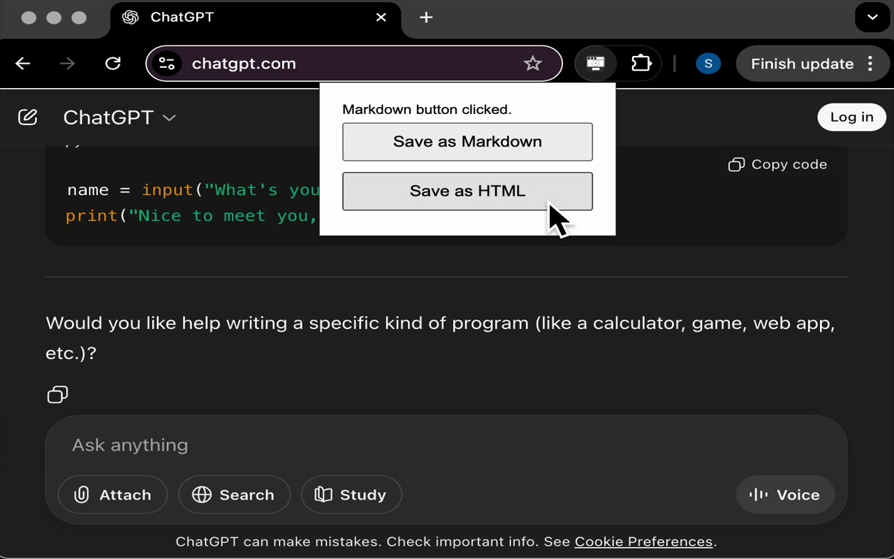

<meta name="google-site-verification" content="mQ9PkPzIueueX29HDzbTO-ahGBu87qsXloI7GRWWkcE" />

# ChatGPT Backup Extension

Save your ChatGPT conversations as Markdown or HTML.

- [Chrome Web Store Listing](https://chrome.google.com/webstore/detail/your-extension-id)
- [Source Code](https://github.com/yourusername/chat-backup-public)

## Features

- Save conversations in Markdown or HTML
- One-click download
- Privacy-friendly

## Installation

Use chrome webstore to search for chat-backup extension and install.

## Screenshots

